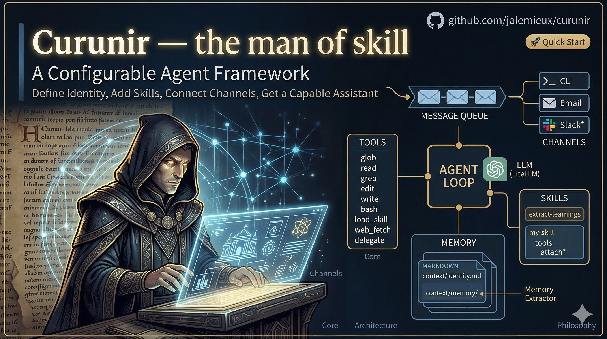

# Curunir — *the man of skill*



A configurable agent framework for building specialized digital assistants. Define an identity, add skills, connect channels — get a capable assistant tailored to your domain.

## Philosophy

Curunir is built on lessons learned from building multiple agentic loop-based assistants using various frontier models:

- **Models are best with bash.** Modern frontier models find the most agency when given shell access and file tools.
- **Skills are prompts.** Complex workflows are captured as markdown instructions the agent loads on demand. Markdown instructions that reference the base tools and any CLI tools available in the container.
- **Context rot is real.** Drift and noise degrade model performance. The system prompt stays minimal — identity, skill manifest, timestamp — and skills are loaded only when needed.
- **Memory is markdown.** Frontier models are very good at reading multi-layered structured markdown files. In our experimentation, this produced better results than sophisticated vector-based RAG pipelines.

## Architecture

```
  Channels              Core                    LLM
  ────────          ──────────              ──────────
  CLI ──────┐
  Email ────┤       ┌──────────┐        ┌──────────────┐
  Slack* ───┴──►  Queue  ──►  Agent Loop  ◄──►  LiteLLM  │
                    └──────────┘        └──────────────┘
                         │
                         ▼
                 ┌───────────────┐
                 │     Tools     │
                 │───────────────│
                 │ glob    read  │
                 │ grep    edit  │
                 │ write   bash  │
                 │ load_skill    │
                 │ web_fetch     │
                 │ delegate      │
                 │ attach*       │
                 └───────────────┘
                 * opt-in, loaded by skills
                         │
                         ▼
                 ┌───────────────┐
                 │   Memory      │
                 │  Extractor    │
                 └───────────────┘

  * planned
```

Messages arrive from any channel, enter a queue, and are processed by the agent loop. The agent calls an LLM with conversation history and tool schemas, iterating up to 15 tool-calling rounds per turn. Replies are routed back to the originating channel.

Dashed nodes are planned but not yet implemented. The memory extractor runs post-session (on `/clear` or `/new`, EOF, or a periodic timer) to extract durable facts into `context/memory/`.

## Project Structure

```
curunir/
├── run.py                  # Entry point — wires channels, queues, agent
├── src/
│   ├── agent/              # Core agent loop and system prompt builder
│   ├── channels/           # Channel implementations (CLI, Email) and router
│   ├── tools/              # Tool schemas, dispatch, and executors
│   ├── config.py           # AgentConfig dataclass
│   ├── llm.py              # LLM interface (LiteLLM)
│   ├── memory_extractor.py # Post-session memory extraction
│   └── skills.py           # Skill manifest and loader
├── skills/                 # Drop-in skills (each a dir with SKILL.md)
│   └── extract-learnings/  # Extract durable knowledge from comms
├── context/
│   ├── identity.md         # Assistant persona and instructions
│   └── memory/             # Persistent markdown memory store
└── Dockerfile              # Container with Python 3.12, ripgrep, git
```

## Quick Start

### Local

```bash
git clone https://github.com/jalemieux/curunir.git
cd curunir
python -m venv .venv && source .venv/bin/activate
pip install -r requirements.txt
cp .env.example .env        # add your API key
vim context/identity.md     # define your assistant's persona
python run.py               # starts CLI channel
```

### Docker

```bash
docker compose up --build
```

#### Email Channel (Gmail)

The email channel connects to Gmail via a Google Workspace service account with domain-wide delegation. No OAuth token management or external CLI tools — just a JSON key file.

```bash
EMAIL_ENABLED=true
GOOGLE_SERVICE_ACCOUNT_FILE=./secrets/service-account.json
GOOGLE_DELEGATED_USER=bot@yourdomain.com
EMAIL_ALLOWED_SENDERS=alice@example.com,bob@example.com
```

See **[docs/gmail-setup.md](docs/gmail-setup.md)** for the full GCP and Workspace Admin setup walkthrough.

## Adding Skills

Drop a directory into `skills/` with a `SKILL.md` file:

```
skills/
└── my-skill/
    └── SKILL.md
```

The `SKILL.md` uses YAML frontmatter for discovery:

```yaml
---
name: my-skill
description: When to use this skill
---

# My Skill

Instructions the agent follows when it loads this skill...
```

Skills appear in the agent's system prompt as a manifest table. The agent calls `load_skill` to fetch full instructions on demand.

### Skill-Requested Tools

Skills can declare opt-in tools that are only available when the skill is loaded. Add a `tools` field to the frontmatter:

```yaml
---
name: deep-research
description: Research a topic in depth
tools: attach
---
```

When the agent loads this skill via `load_skill`, the listed tools are added to the agent's tool set for the remainder of the session. This keeps the default tool set lean while allowing skills to unlock capabilities they need.

**Available opt-in tools:**

| Tool | Description |
|------|-------------|
| `attach` | Attach a file to the agent's response. Delivered as an email attachment, CLI file path, etc. depending on channel. |

## Evals

Simple eval harness that sends prompts to Curunir over WebSocket and records results.

```bash
# Run basic evals (tool use, planning, memory, instruction following)
python run_evals.py

# Run advanced evals (web search, deep research, delegation, cross-skill orchestration)
python run_evals.py --file advanced_evals.md

# Against a remote instance
python run_evals.py --host myserver.example.com --port 8765
```

Results are saved to `eval_results/` as timestamped JSON files including the model name, all prompts, responses, and tool calls.

- `simple_evals.md` — 18 prompts testing core capabilities (no API keys needed)
- `advanced_evals.md` — 30 prompts testing skills like web-search, deep-research, and delegation (requires `BRAVE_API_KEY` and network access)

## Configuration

Configuration is handled via `src/config.py`:

| Setting | Default | Description |
|---------|---------|-------------|
| `model` | `anthropic/claude-sonnet-4-20250514` | LLM model (any LiteLLM-supported model) |
| `max_iterations` | `15` | Max tool-calling rounds per turn |
| `identity_file` | `./context/identity.md` | Path to persona file |
| `context_dir` | `./context` | Path to context directory (memory, etc.) |
| `skill_dirs` | `[./skills, ./context/skills]` | Directories scanned for skills in priority order (first-seen wins on name collision) |

API keys are set via environment variables (`ANTHROPIC_API_KEY`, `OPENAI_API_KEY`, etc.).

## License

TBD
