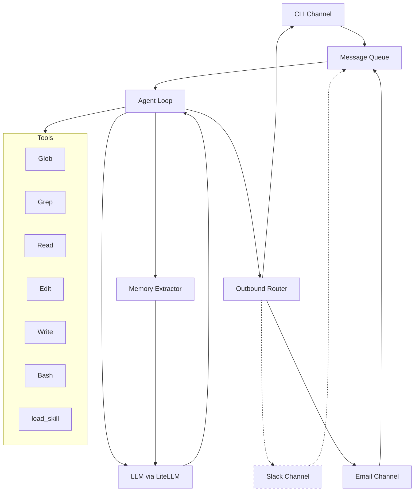

# Curunir


A configurable agent framework for building specialized digital assistants. Define an identity, add skills, connect channels — get a capable assistant tailored to your domain.

## Philosophy

Curunir is built on lessons learned from building multiple agentic loop-based assistants using various frontier models:

- **Models are best with bash.** Modern frontier models find the most agency when given shell access and file tools.
- **Skills are prompts.** Complex workflows are captured as markdown instructions the agent loads on demand. Markdown instructions that reference the base tools and any CLI tools available in the container.
- **Context rot is real.** Drift and noise degrade model performance. The system prompt stays minimal — identity, skill manifest, timestamp — and skills are loaded only when needed.
- **Memory is markdown.** Frontier models are very good at reading multi-layered structured markdown files. In our experimentation, this produced better results than sophisticated vector-based RAG pipelines.

## Architecture



Messages arrive from any channel, enter a queue, and are processed by the agent loop. The agent calls an LLM with conversation history and tool schemas, iterating up to 15 tool-calling rounds per turn. Replies are routed back to the originating channel.

Dashed nodes are planned but not yet implemented. The memory extractor runs post-session (on `/clear`, EOF, or a periodic timer) to extract durable facts into `context/memory/`.

## Project Structure

```
curunir/
├── run.py                  # Entry point — wires channels, queues, agent
├── src/
│   ├── agent/              # Core agent loop and system prompt builder
│   ├── channels/           # Channel implementations (CLI, Email) and router
│   ├── tools/              # Tool schemas, dispatch, and executors
│   ├── config.py           # AgentConfig dataclass
│   ├── llm.py              # LLM interface (LiteLLM)
│   ├── memory_extractor.py # Post-session memory extraction
│   └── skills.py           # Skill manifest and loader
├── skills/                 # Drop-in skills (each a dir with SKILL.md)
│   └── extract-learnings/  # Extract durable knowledge from comms
├── context/
│   ├── identity.md         # Assistant persona and instructions
│   └── memory/             # Persistent markdown memory store
└── Dockerfile              # Container with Python 3.12, ripgrep, git
```

## Quick Start

### Local

```bash
git clone https://github.com/jalemieux/curunir.git
cd curunir
python -m venv .venv && source .venv/bin/activate
pip install -r requirements.txt
cp .env.example .env        # add your API key
vim context/identity.md     # define your assistant's persona
python run.py               # starts CLI channel
```

### Docker

```bash
docker build -t curunir .
docker run --env-file .env -it curunir
```

## Adding Skills

Drop a directory into `skills/` with a `SKILL.md` file:

```
skills/
└── my-skill/
    └── SKILL.md
```

The `SKILL.md` uses YAML frontmatter for discovery:

```yaml
---
name: my-skill
description: When to use this skill
---

# My Skill

Instructions the agent follows when it loads this skill...
```

Skills appear in the agent's system prompt as a manifest table. The agent calls `load_skill` to fetch full instructions on demand.

## Configuration

Configuration is handled via `src/config.py`:

| Setting | Default | Description |
|---------|---------|-------------|
| `model` | `anthropic/claude-sonnet-4-20250514` | LLM model (any LiteLLM-supported model) |
| `max_iterations` | `15` | Max tool-calling rounds per turn |
| `identity_file` | `./context/identity.md` | Path to persona file |
| `context_dir` | `./context` | Path to context directory (memory, etc.) |
| `skills_dir` | `./skills` | Path to skills directory |

API keys are set via environment variables (`ANTHROPIC_API_KEY`, `OPENAI_API_KEY`, etc.).

## License

TBD
